# CS202 计算机组成原理 CPU大作业

### 一、组员及分工

* 12012710 黄梓通（33.3%）：汇编测试2
* 12012801 金扬（33.3%）：IO组件 顶层连线 汇编测试1
* 12011327 刘乐奇（33.3%）：基础组件 Uart

### 二、顶层模块

	顶层模块既包括了所有CPU的基础组件，又包括了所有IO组件。由于顶层模块组件太多，可以先了解各个子模块。

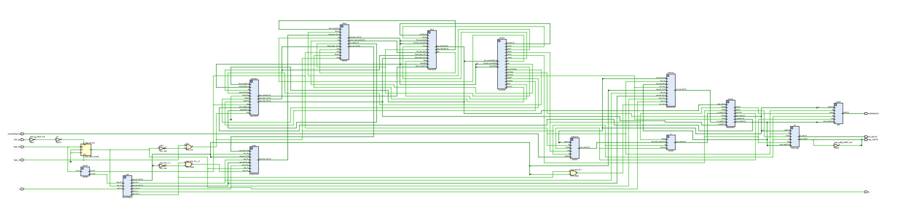

### 三、CPU架构设计说明

ISA：minisys32， 严格按照课件上描述的ISA设计，未作扩展和修改，不支持异常处理。

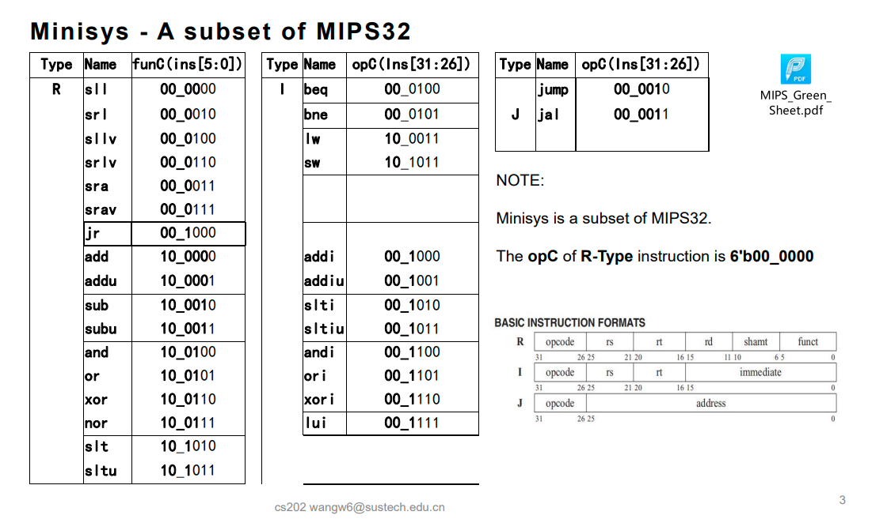

寻址空间：属于哈佛结构

​					seg display: 0xFFFF FC82, 0xFFFF FC820

​					switch : 0xFFFF FC72,0xFFFF FC70

​					led: 0xFFFF FC62, 0xFFFF FC60 

CPI = 1

不支持Pipeline

接口： 时钟， 复位， uart接口， 数码管接口

### 四、子模块

#### 1、Ifetc32 （Instruction Fetch）

	该模块用于从programrom（即指令内存）中取出指令，并根据指令在时钟的下降沿更新PC。

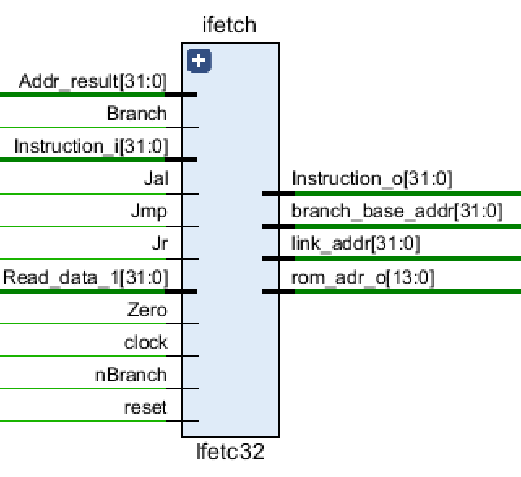

```verilog
// from top
input clock, reset;           // Clock and reset

// from programrom
input[31:0] Instruction_i;

// from ALU
input[31:0] Addr_result;      // the calculated address from ALU
input Zero;                   // while Zero is 1, it means the ALUresult is zero
    
// from Decoder
input[31:0] Read_data_1;      // the address of instruction used by jr instruction
    
// from Controller
input Branch;                 // while Branch is 1,it means current instruction is beq
input nBranch;                // while nBranch is 1,it means current instruction is bnq
input Jmp;                    // while Jmp 1, it means current instruction is jump
input Jal;                    // while Jal is 1, it means current instruction is jal
 input Jr;                    // while Jr is 1, it means current instruction is jr

output[31:0] Instruction_o;   // the instruction fetched from this module
output[31:0] branch_base_addr;// (pc+4) to ALU which is used by branch type instruction
output reg [31:0] link_addr;  // (pc+4) to Decoder which is used by jal instruction
output[13:0] rom_adr_o;       // pc[15:2]
```

#### 2、decode32 (Decoder)

	解析指令，并对立即数做符号扩展。
	
	addi (001000) (sign), addiu (001001) (sign), slti(001010) (sign) 做的都是有符号扩展，而 sltiu (001011) (zero), andi(001100)(zero), ori(001101)(zero), xori(001110)(zero) 做的都是无符号扩展。lui (001111) {imm, 16'b0} 这条指令将会在ALU中处理。

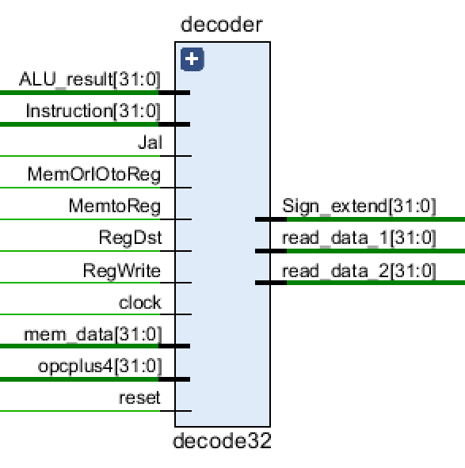

```verilog
input        clock, reset;    // 时钟和复位
input[31:0]  Instruction;     // 取指单元来的指令
input[31:0]  mem_data;        // 从DATA RAM or I/O port取出的数据
input[31:0]  ALU_result;      // 从执行单元来的运算的结果
input        Jal;             // 来自控制单元，说明是JAL指令 
input        RegWrite;        // 来自控制单元
input        MemtoReg;        // 来自控制单元
input        RegDst;             
input[31:0]  opcplus4;        // 来自取指单元，JAL中用
input        MemOrIOtoReg;

output[31:0] read_data_1;     // 输出的第一操作数
output[31:0] read_data_2;     // 输出的第二操作数
output[31:0] Sign_extend;     // 扩展后的32位立即数
```

#### 3、control32（Controller）

	由一系列的组合逻辑电路构成。执行指令解析后对应的操作，并发送相应的信号到其他模块。

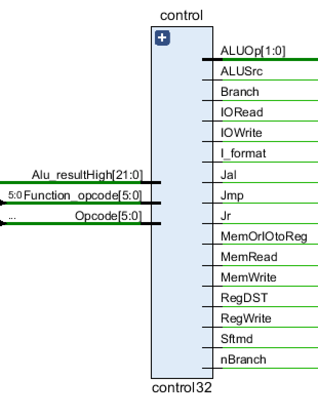

```verilog
input[5:0] Opcode;              // instruction[31..26], Opcodecode
input[5:0] Function_opcode;     // instructions[5..0], Function_opcode
// The real address of LW and SW is Alu_Result, the signal comes from the execution unit
// From the execution unit Alu_Result[31..10], used to help determine whether to process Mem or I
input[21:0] Alu_resultHigh; // From the execution unit Alu_Result[31..10]
    
output Jr;                 // 1 indicates the instruction is "jr", otherwise it's not "jr" 
output Jmp;                 // 1 indicate the instruction is "j", otherwise it's not
output Jal;                 // 1 indicate the instruction is "jal", otherwise it's not
output Branch;              // 1 indicate the instruction is "beq" , otherwise it's not
output nBranch;             // 1 indicate the instruction is "bne", otherwise it's not
output RegDST;              // 1 indicate destination register is "rd"(R),otherwise it's "rt"(I)
output MemtoReg;            // 1 indicate read data from memory and write it into register
output RegWrite;            // 1 indicate write register(R,I(lw)), otherwise it's not
output MemWrite;            // 1 indicate write data memory, otherwise it's not
output ALUSrc;              // 1 indicate the 2nd data is immidiate (except "beq","bne")
output Sftmd;               // 1 indicate the instruction is shift instruction
output I_format;            // 1 indicate the instruction is I-type but isn't "beq","bne","LW" or "SW" 
output[1:0] ALUOp;          // if the instruction is R-type or I_format, ALUOpcode is 2'b10;
                                // if the instruction is"beq" or "bne", ALUOpcode is 2'b01??
                                // if the instruction is"lw" or "sw", ALUOpcode is 2'b00??
    
output MemOrIOtoReg;        // 1 indicates that data needs to be read from memory or I/O to the register
output MemRead;             // 1 indicates that the instruction needs to read from the memory
output IORead;              // 1 indicates I/O read
output IOWrite;             // 1 indicates I/O write
```

#### 4、executs32 （ALU）

	执行一系列的算术逻辑操作，包括地址的计算结果。

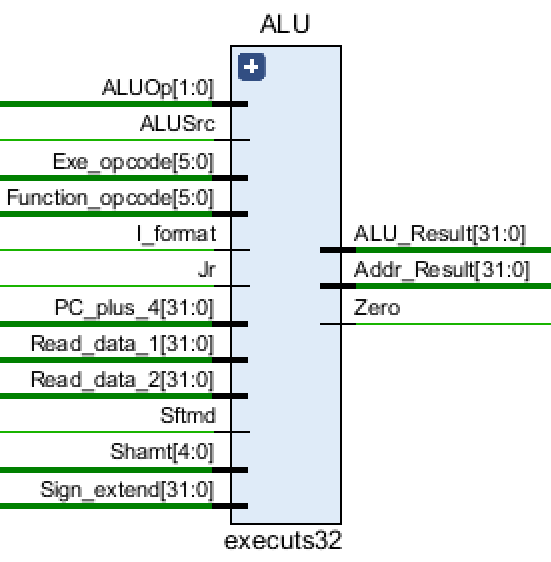

```verilog
// from Decoder
input[31:0] Read_data_1;        // the source of Ainput
input[31:0] Read_data_2;        // one of the sources of Binput
input[31:0] Sign_extend;        // one of the sources of Binput

// from IFetch
input[5:0] Exe_opcode;          // instruction[31:26]
input[5:0] Function_opcode;     // instructions[5:0]
input[4:0] Shamt;               // instruction[10:6], the amount of shift bits
input[31:0] PC_plus_4;          // pc+4

// from Controller
input[1:0] ALUOp;               // { (R_format || I_format) , (Branch || nBranch) }
input ALUSrc;                   // 1 means the 2nd operand is an immedite (except beq, bne）
input I_format;                 // 1 means I-Type instruction except beq, bne, LW, SW
input Sftmd;                    // 1 means this is a shift instruction
input Jr;                       // 1 means this is a jr
    
output Zero;                    // 1 means the ALU_reslut is zero, 0 otherwise  
output reg[31:0] ALU_Result;    // the ALU calculation result
output[31:0] Addr_Result;       // the calculated instruction address
```

#### 5、dmemory32（Data Memory）

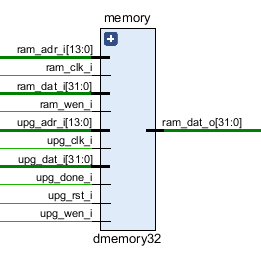

```verilog
input ram_clk_i;                      // from CPU top
input ram_wen_i;                      // from Controller
input [13:0] ram_adr_i;               // from alu_result of ALU
input [31:0] ram_dat_i;               // from read_data_2 of Decoder

// UART Programmer Pinouts
input upg_rst_i;                      // UPG reset (Active High)
input upg_clk_i;                      // UPG ram_clk_i (10MHz)
input upg_wen_i;                      // UPG write enable
input [13:0] upg_adr_i;               // UPG write address
input [31:0] upg_dat_i;               // UPG write data
input upg_done_i;                     // 1 if programming is finished

output [31:0] ram_dat_o;              // the data read from data-ram
```

#### 6、MemOrIO（Memory or IO）

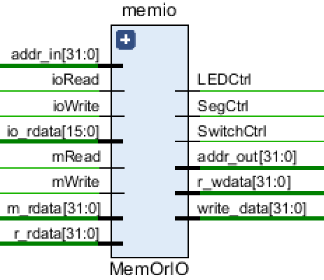

```verilog
input mRead;                // read memory, from Controller
input mWrite;               // write memory, from Controller
input ioRead;               // read IO, from Controller
input ioWrite;              // write IO, from Controller
    
input[31:0] addr_in;        // from alu_result in ALU
    
input[31:0] m_rdata;        // data read from Data-Memory
input[15:0] io_rdata;       // data read from IO,16 bits

input[31:0] r_rdata;        // data read from Decoder(register file)

output[31:0] addr_out;      // address to Data-Memory
output[31:0] r_wdata;       // data to Decoder (register file)
output reg[31:0] write_data;// data to memory or I/O（m_wdata, io_wdata）
    
output LEDCtrl;             // LED Chip Select
output SwitchCtrl;          // Switch Chip Select
output SegCtrl;             // Segment Display Select
```

#### 7、programrom（Program ROM）

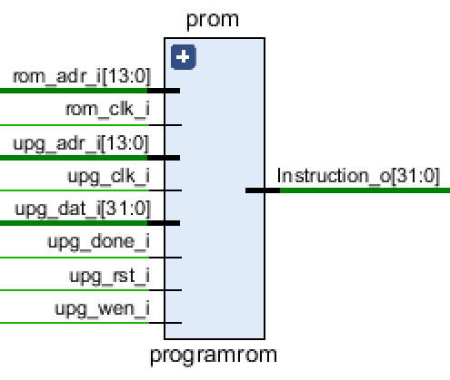

```verilog
// Program ROM Pinouts
input rom_clk_i,                // ROM clock
input[13:0] rom_adr_i,          // From IFetch

output [31:0] Instruction_o,    // To IFetch
    
// UART Programmer Pinouts
input upg_rst_i,                // UPG reset (Active High)
input upg_clk_i,                // UPG clock (10MHz)
input upg_wen_i,                // UPG write enable
input[13:0] upg_adr_i,          // UPG write address
input[31:0] upg_dat_i,          // UPG write data
input upg_done_i                // 1 if program finished
```

#### 8、ioread（IO read）

Used for managing data read from multiple data sources. But in the end we don't find any necessity to add another input device other than switch, so this actually have no use.

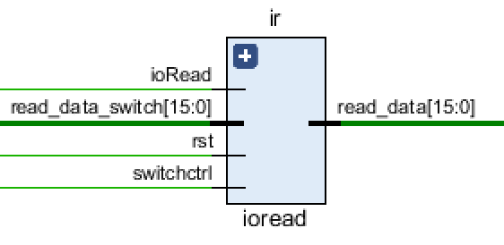

```verilog
input rst;			
input ioRead;                  // ioRead from controller
input switchctrl;		       // switchctrl from MemOrIO
input[15:0] read_data_switch;  // data read from switch

output[15:0] read_data;	       // to MemOrIO
```

#### 9、led16（LED）

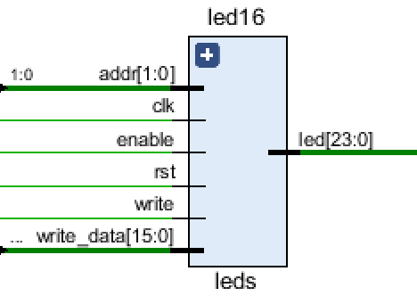

```verilog
input clk;    		    
input rst; 		        
input write;		        // ioWrite from controller
input enable;		        // ledctrl from MemOrIO
input[1:0] addr;	        // last 2 bit of address
input[15:0] write_data;	    // data written to the led

output reg[23:0] led;	    // 24 bit signal sent to board
```

#### 10、switch16（Switch）

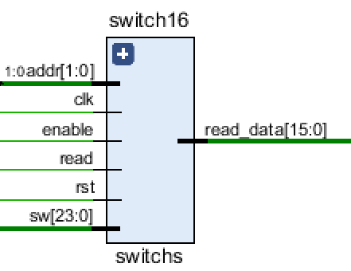

```verilog
input clk;			       
input rst;			       
input enable;			    // SwitchCtrl from MemOrIO
input[1:0] addr;		    // last 2 bit of address
input read;			        // ioRead from controller

output reg [15:0] read_data;// data read from switch, sent to ioRead
input [23:0] sw;		    // from the 24 switches on board
```

#### 11、scan_seg（Scan Seg）

The target of this module is to accept input from sw instruction and display the data on the 7 seg display.

To achieve this, we have a enable signal (connected to SegCtrl in MemOrIO module) and write signal (connected to SegCtrl in MemOrIO module). Only when both write signal and enable signal is 1 then the module update the stored data with the input(write_data).

To output the data into the seg display, we have a reg scan_cnt that loop from 0 to 3'b111. And we have a combinational logic to enable the scan_reg's seg display and let the selected seg display display the corresponding 4 bit.

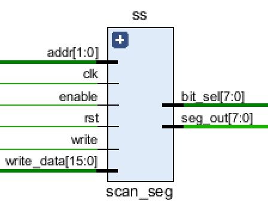

```verilog
module scan_seg(
    input clk,
    input rst,
    input write,
    input enable,
    input[1:0] addr,	        // last 2 bit of address
    input[15:0] write_data,	  //  data written to the led
    output [7:0] bit_sel,
    output [7:0] seg_out
);

reg error = 0;
reg [1:0] errorType = 0;
reg [15:0] state = 16'b10_10_10_10_10_10_10_10; // 00 for lights out, 01 for lights flickering, 10 for lights on
reg [31:0] data = 32'h0;
reg clkout;
reg l_clkout;
reg [31:0] cnt;
reg [31:0] l_cnt;
reg [2:0] scan_cnt;
reg [6:0] Y_reg;
reg [7:0] bit_sel_reg;

parameter  period = 50000;
parameter  l_period = 50_000_000;

assign seg_out = {Y_reg, 1'b1};
assign bit_sel = bit_sel_reg;

always@(posedge clk or posedge rst) begin
    if(rst) begin
        data <= 32'h0000_0000;
    end
	else if(enable && write) begin
		if(addr == 2'b00)
			data[31:0] <= { data[31:16], write_data[15:0] };
		else if(addr == 2'b10 )
			data[31:0] <= { write_data[15:0], data[15:0] };
		else
			data <= data;
    end
	else begin
		data <= data;
    end
end

always @(posedge clk)
begin
    if(rst == 1) begin 
        cnt <= 0;
        clkout = 0;
    end
    else begin 
        if(cnt == (period >> 1) - 1) begin
            clkout <= ~clkout;
            cnt <= 0;
        end
        else
            cnt <= cnt + 1;
    end
end

always @(posedge clk)
begin
    if(rst == 1) begin 
        l_cnt <= 0;
        l_clkout <= 0;
    end
    else begin 
        if(l_cnt == (l_period >> 1) - 1) begin
            l_clkout <= ~l_clkout;
            l_cnt <= 0;
        end
        else
            l_cnt <= l_cnt + 1;
    end
end

always @(posedge clkout)
begin
    if(rst == 1)
        scan_cnt <= 0;
    else begin
        if(scan_cnt == 3'b111)
            scan_cnt <= 0;
        else
        scan_cnt <= scan_cnt + 1;
    end
end

always @(scan_cnt)
begin
    if(rst == 1)
        bit_sel_reg = 8'b00000000;
    else
    case(scan_cnt)
        3'b000: bit_sel_reg = ~8'b00000001;
        3'b001: bit_sel_reg = ~8'b00000010;
        3'b010: bit_sel_reg = ~8'b00000100;
        3'b011: bit_sel_reg = ~8'b00001000;
        3'b100: bit_sel_reg = ~8'b00010000;
        3'b101: bit_sel_reg = ~8'b00100000;
        3'b110: bit_sel_reg = ~8'b01000000;
        3'b111: bit_sel_reg = ~8'b10000000;
    endcase
end

always @(scan_cnt)
begin
    if(error == 0)
    begin
        case(scan_cnt)
                3'b000: 
                if(state[1:0] == 0 || ((state[1:0] == 1) && l_clkout == 0))
                    Y_reg = ~7'b0000_000;
                else
                case (data[3:0])
                    0:Y_reg = ~7'b1111_110;   //0
                    1:Y_reg = ~7'b0110_000;   //1
                    2:Y_reg = ~7'b1101_101;   //2
                    3:Y_reg = ~7'b1111_001;   //3
                    4:Y_reg = ~7'b0110_011;   //4
                    5:Y_reg = ~7'b1011_011;   //5
                    6:Y_reg = ~7'b1011_111;   //6
                    7:Y_reg = ~7'b1110_000;   //7
                    8:Y_reg = ~7'b1111_111;   //8
                    9:Y_reg = ~7'b1110_011;   //9
                    10:Y_reg = ~7'b1110_111; //A
                    11:Y_reg = ~7'b0011_111; // b
                    12:Y_reg = ~7'b0001_101; // c
                    13:Y_reg = ~7'b0111_101; // d
                    14:Y_reg = ~7'b1001_111; // E
                    15:Y_reg = ~7'b1000_111; // F
                endcase    
                3'b001:
                if(state[3:2] == 0 || ((state[3:2] == 1) && l_clkout == 0))
                    Y_reg = ~7'b0000_000;
                else
                case (data[7:4])
                    0:Y_reg = ~7'b1111_110;   //0
                    1:Y_reg = ~7'b0110_000;   //1
                    2:Y_reg = ~7'b1101_101;   //2
                    3:Y_reg = ~7'b1111_001;   //3
                    4:Y_reg = ~7'b0110_011;   //4
                    5:Y_reg = ~7'b1011_011;   //5
                    6:Y_reg = ~7'b1011_111;   //6
                    7:Y_reg = ~7'b1110_000;   //7
                    8:Y_reg = ~7'b1111_111;   //8
                    9:Y_reg = ~7'b1110_011;   //9
                    10:Y_reg = ~7'b1110_111; //A
                    11:Y_reg = ~7'b0011_111; // b
                    12:Y_reg = ~7'b0001_101; // c
                    13:Y_reg = ~7'b0111_101; // d
                    14:Y_reg = ~7'b1001_111; // E
                    15:Y_reg = ~7'b1000_111; // F
                endcase
                3'b010:
                if(state[5:4] == 0 || ((state[5:4] == 1) && l_clkout == 0))
                    Y_reg = ~7'b0000_000;
                else
                case (data[11:8])
                    0:Y_reg = ~7'b1111_110;   //0
                    1:Y_reg = ~7'b0110_000;   //1
                    2:Y_reg = ~7'b1101_101;   //2
                    3:Y_reg = ~7'b1111_001;   //3
                    4:Y_reg = ~7'b0110_011;   //4
                    5:Y_reg = ~7'b1011_011;   //5
                    6:Y_reg = ~7'b1011_111;   //6
                    7:Y_reg = ~7'b1110_000;   //7
                    8:Y_reg = ~7'b1111_111;   //8
                    9:Y_reg = ~7'b1110_011;   //9
                    10:Y_reg = ~7'b1110_111; //A
                    11:Y_reg = ~7'b0011_111; // b
                    12:Y_reg = ~7'b0001_101; // c
                    13:Y_reg = ~7'b0111_101; // d
                    14:Y_reg = ~7'b1001_111; // E
                    15:Y_reg = ~7'b1000_111; // F
                endcase
                3'b011:
                if(state[7:6] == 0 || ((state[7:6] == 1) && l_clkout == 0))
                    Y_reg = ~7'b0000_000;
                else
                case (data[15:12])
                    0:Y_reg = ~7'b1111_110;   //0
                    1:Y_reg = ~7'b0110_000;   //1
                    2:Y_reg = ~7'b1101_101;   //2
                    3:Y_reg = ~7'b1111_001;   //3
                    4:Y_reg = ~7'b0110_011;   //4
                    5:Y_reg = ~7'b1011_011;   //5
                    6:Y_reg = ~7'b1011_111;   //6
                    7:Y_reg = ~7'b1110_000;   //7
                    8:Y_reg = ~7'b1111_111;   //8
                    9:Y_reg = ~7'b1110_011;   //9
                    10:Y_reg = ~7'b1110_111; //A
                    11:Y_reg = ~7'b0011_111; // b
                    12:Y_reg = ~7'b0001_101; // c
                    13:Y_reg = ~7'b0111_101; // d
                    14:Y_reg = ~7'b1001_111; // E
                    15:Y_reg = ~7'b1000_111; // F
                endcase
                3'b100:
                if(state[9:8] == 0 || ((state[9:8] == 1) && l_clkout == 0))
                    Y_reg = ~7'b0000_000;
                else
                case (data[19:16])
                    0:Y_reg = ~7'b1111_110;   //0
                    1:Y_reg = ~7'b0110_000;   //1
                    2:Y_reg = ~7'b1101_101;   //2
                    3:Y_reg = ~7'b1111_001;   //3
                    4:Y_reg = ~7'b0110_011;   //4
                    5:Y_reg = ~7'b1011_011;   //5
                    6:Y_reg = ~7'b1011_111;   //6
                    7:Y_reg = ~7'b1110_000;   //7
                    8:Y_reg = ~7'b1111_111;   //8
                    9:Y_reg = ~7'b1110_011;   //9
                    10:Y_reg = ~7'b1110_111; //A
                    11:Y_reg = ~7'b0011_111; // b
                    12:Y_reg = ~7'b0001_101; // c
                    13:Y_reg = ~7'b0111_101; // d
                    14:Y_reg = ~7'b1001_111; // E
                    15:Y_reg = ~7'b1000_111; // F
                endcase
                3'b101:
                if(state[11:10] == 0 || ((state[11:10] == 1) && l_clkout == 0))
                    Y_reg = ~7'b0000_000;
                else
                case (data[23:20])
                    0:Y_reg = ~7'b1111_110;   //0
                    1:Y_reg = ~7'b0110_000;   //1
                    2:Y_reg = ~7'b1101_101;   //2
                    3:Y_reg = ~7'b1111_001;   //3
                    4:Y_reg = ~7'b0110_011;   //4
                    5:Y_reg = ~7'b1011_011;   //5
                    6:Y_reg = ~7'b1011_111;   //6
                    7:Y_reg = ~7'b1110_000;   //7
                    8:Y_reg = ~7'b1111_111;   //8
                    9:Y_reg = ~7'b1110_011;   //9
                    10:Y_reg = ~7'b1110_111; //A
                    11:Y_reg = ~7'b0011_111; // b
                    12:Y_reg = ~7'b0001_101; // c
                    13:Y_reg = ~7'b0111_101; // d
                    14:Y_reg = ~7'b1001_111; // E
                    15:Y_reg = ~7'b1000_111; // F
                endcase  
                3'b110:
                if(state[13:12] == 0 || ((state[13:12] == 1) && l_clkout == 0))
                    Y_reg = ~7'b0000_000;
                else
                case (data[27:24])
                    0:Y_reg = ~7'b1111_110;   //0
                    1:Y_reg = ~7'b0110_000;   //1
                    2:Y_reg = ~7'b1101_101;   //2
                    3:Y_reg = ~7'b1111_001;   //3
                    4:Y_reg = ~7'b0110_011;   //4
                    5:Y_reg = ~7'b1011_011;   //5
                    6:Y_reg = ~7'b1011_111;   //6
                    7:Y_reg = ~7'b1110_000;   //7
                    8:Y_reg = ~7'b1111_111;   //8
                    9:Y_reg = ~7'b1110_011;   //9
                    10:Y_reg = ~7'b1110_111; //A
                    11:Y_reg = ~7'b0011_111; // b
                    12:Y_reg = ~7'b0001_101; // c
                    13:Y_reg = ~7'b0111_101; // d
                    14:Y_reg = ~7'b1001_111; // E
                    15:Y_reg = ~7'b1000_111; // F
                endcase
                3'b111:
                if(state[15:14] == 0 || ((state[15:14] == 1) && l_clkout == 0))
                    Y_reg = ~7'b0000_000;
                else
                case (data[31:28])
                    0:Y_reg = ~7'b1111_110;   //0
                    1:Y_reg = ~7'b0110_000;   //1
                    2:Y_reg = ~7'b1101_101;   //2
                    3:Y_reg = ~7'b1111_001;   //3
                    4:Y_reg = ~7'b0110_011;   //4
                    5:Y_reg = ~7'b1011_011;   //5
                    6:Y_reg = ~7'b1011_111;   //6
                    7:Y_reg = ~7'b1110_000;   //7
                    8:Y_reg = ~7'b1111_111;   //8
                    9:Y_reg = ~7'b1110_011;   //9
                    10:Y_reg = ~7'b1110_111; //A
                    11:Y_reg = ~7'b0011_111; // b
                    12:Y_reg = ~7'b0001_101; // c
                    13:Y_reg = ~7'b0111_101; // d
                    14:Y_reg = ~7'b1001_111; // E
                    15:Y_reg = ~7'b1000_111; // F
                endcase
                default: Y_reg = ~7'b0000_000;   //all disabled
        endcase  
        end
        else
        begin
            case(scan_cnt)
                3'b000:
                case (errorType)
                    2'b00:Y_reg = ~7'b0000_000;   //off
                    2'b01:Y_reg = ~7'b0110_000;   //1
                    2'b10:Y_reg = ~7'b1101_101;   //2
                    2'b11:Y_reg = ~7'b1111_001;   //3
                endcase
                3'b001: 
                Y_reg = ~7'b0000101;   //r
                3'b010:
                Y_reg = ~7'b0011101;  //o
                3'b011:
                Y_reg = ~7'b0000101;   //r
                3'b100:
                Y_reg = ~7'b0000101;   //r
                3'b101:
                Y_reg = ~7'b1001111;    //E
                default: Y_reg = ~7'b0000_000;   //all disabled
        endcase     
        end  
    end
endmodule
```
### 五：测试场景

基本功能测试：


| 测试方法 | 测试类型 | 测试用例描述                                                 | 测试结果 |
| -------- | -------- | ------------------------------------------------------------ | -------- |
| 上板     | 集成     | 把sw[15:0]读出再存到led和seg中的四个位置                     | 通过     |
| 上板     | 集成     | 在内存中存入4个word, 读取其中第2个Word并输出到Seg中          | 通过     |
| 上板     | 集成     | 给定两个输入，判断srl, srlv, sll, sllv, add, or ,and sub的正确性 | 通过     |
| 上板     | 集成     | 写一个简单的用jal实现的循环，将 ra 的值输出到Seg中，观察 ra值是否正确 | 通过     |
| 上板     | 集成     | 是用slt, sltu比较sw[23:16]和sw[15:0]的值，如果前者小于后者点亮led[0]，否则点亮led[1] | 通过     |
| 上板     | 集成     | 给两个寄存器赋值并用beq bne比较两个寄存器的值，观察跳转是否正常 | 通过     |


#### 测试场景1：


#### 测试场景2：

​		

| 测试数据（以十进制表示）         | 测试结果 |
| -------------------------------- | -------- |
| 0，1，-2，3，-4，5，-6，7，-8，9 | 通过     |
| -2，-3，1                        | 通过     |
| -2，1                            | 通过     |
| -2                               | 通过     |

			      		
	
.text 0x0000
start:	lui   $1,0xFFFF			
        ori   $30,$1,0xF000	
        # reset all the registers to 0, except $30
        sub $0, $0, $0
        sub $1, $1, $1
        sub $2, $2, $2
        sub $3, $3, $3
        sub $4, $4, $4
        sub $5, $5, $5
        sub $6, $6, $6
        sub $7, $7, $7
        sub $8, $8, $8
        sub $9, $9, $9
        sub $10, $10, $10
        sub $11, $11, $11
        sub $12, $12, $12
        sub $13, $13, $13
        sub $14, $14, $14
        sub $15, $15, $15
        sub $16, $16, $16
        sub $17, $17, $17
        sub $18, $18, $18
        sub $19, $19, $19
        sub $20, $20, $20
        sub $21, $21, $21
        sub $22, $22, $22
        sub $23, $23, $23
        sub $24, $24, $24
        sub $25, $25, $25
        sub $26, $26, $26
        sub $27, $27, $27
        sub $28, $28, $28
        sub $29, $29, $29
        sub $31, $31, $31
        
        lui $25,0x1
        srl $25,$25,16    #$25 is 1
         
inputcase:
  	lw $2,0xC72($30)  #$2 decide which case
        
        srl $2, $2, 5
        
        sub $27, $27, $27
    	beq $2, $27, case0
    	
    	sub $27, $27, $27
	ori $27, $27, 0x1
    	beq $2, $27, case1
    	
    	sub $27, $27, $27
	ori $27, $27, 0x2
    	beq $2, $27, case2
    	
    	sub $27, $27, $27
	ori $27, $27, 0x3
    	beq $2, $27, case3

	sub $27, $27, $27
    	ori $27, $27, 0x4
    	beq $2, $27, case4
    	
    	sub $27, $27, $27
    	ori $27, $27, 0x5
    	beq $2, $27, case5
    	
    	sub $27, $27, $27
    	ori $27, $27, 0x6
    	beq $2, $27, case6
    	
    	sub $27, $27, $27
    	ori $27, $27, 0x7
    	beq $2, $27, case7


        j inputcase
        
case0:	
	lw $4,0xC72($30) #$4:whether to input $3
	andi $4,$4,0x10
	srl $4,$4,4
	beq $4,$0,state1
	lw $3,0xC70($30)
	andi $3,$3,0xF
	sll $4,$3,2
	lui $20,0x1001 #A[0]  dataset0
	sub $21,$20,$4 #A[1]  dataset1
	sub $22,$21,$4 #A[2]  dataset2
	sub $23,$22,$4 #A[3]  dataset3
	j inputcase
state1: 
	lw $5,0xC70($30)
	andi $5,$5,0xF00
	srl $5,$5,8       # which number to input
	
	lw $6,0xC70($30)
	andi $6,$6,0xFF
	
	sll $5,$5,2
	add $5,$5,$20
	sw $6,0($5)
	sw $6,0xC60($30)
	j inputcase
	
case1:
	sub $14,$14,$14
copy:
	beq $14,$3,endcopy    #copy dataset0 to dataset1
	sll $4,$14,2
	add $6,$4,$20
	lw $5,0($6)
	add $7,$4,$21
	sw $5,0($7)
	add $14,$14,$25
	j copy
endcopy:
	sub $14,$14,$14
sort1:  			#sort dataset1
	sub $7,$3,$25
	beq $14,$7,endsort
	sub $15,$15,$15
sort2:  sub $8,$3,$14
	sub $8,$8,$25
	beq $15,$8,endsort2
	add $9,$15,$25
	sll $9,$9,2  #$9=4*($15+1)
	sll $10,$15,2 #$10=4*$15
	
	add $11,$21,$9
	add $12,$21,$10
	lw $6,0($11)
	lw $5,0($12)
	slt $4,$6,$5
	bne $4,$25,endif
	sw $5,0($11)
	sw $6,0($12)
endif:
	add $15,$15,$25
	j sort2
endsort2:
	add $14,$14,$25
	j sort1
endsort:
	j inputcase
	
case2:
	
	sub $14,$14,$14
copy2:	beq $14,$3,endCopy2       #get number from dataset0
	sll $4,$14,2
	add $7,$20,$4
	lw $5,0($7)
	andi $6,$5,0x80
	 
	beq $6,$0,endif1
	andi $5,$5,0x7F
	sub $8,$8,$8		#transform it to complement
	addi $8,$8,0xFFFFFFFF
	sub $5,$8,$5
	add $5,$5,$25
endif1:
	add $7,$4,$22
	sw $5,0($7)
	
	add $14,$14,$25
	j copy2
endCopy2:
	j inputcase	

case3:	 

	sub $14,$14,$14
copy_3:
	beq $14,$3,endcopy_3  #copy dataset2 to dataset3
	sll $4,$14,2
	add $6,$4,$22
	lw $5,0($6)
	add $7,$4,$23
	sw $5,0($7)
	add $14,$14,$25
	j copy_3
endcopy_3:
	sub $14,$14,$14
	
sort1_3:		
	sub $7,$3,$25		#sort dataset3
	beq $14,$7,endsort_3
	sub $15,$15,$15
sort2_3:  sub $8,$3,$14
	sub $8,$8,$25
	beq $15,$8,endsort2_3
	add $9,$15,$25
	sll $9,$9,2  #$9=4*($15+1)
	sll $10,$15,2 #$10=4*$15
	
	add $11,$23,$9
	add $12,$23,$10
	lw $6,0($11)
	lw $5,0($12)
	slt $4,$6,$5
	bne $4,$25,endif_3
	sw $5,0($11)
	sw $6,0($12)
endif_3:
	add $15,$15,$25
	j sort2_3
endsort2_3:
	add $14,$14,$25
	j sort1_3
endsort_3:
	j inputcase
	
case4:
	sub $6,$3,$25
	sll $6,$6,2
	add $7,$6,$21
	lw $4,0($7)
	lw $5,0($21)
	sub $4,$4,$5
	sw $4, 0xC60($30)
	sw $4, 0xC80($30)
	
    	
    	j inputcase
    	
case5:
	sub $6,$3,$25
	sll $6,$6,2
	add $7,$6,$23
	lw $4,0($7)
	lw $5,0($23)
	sub $4,$4,$5
	sw $4, 0xC60($30)
	sw $4, 0xC80($30)
	
    	j inputcase
    	
case6:	
	lw $4,0xC72($30)
	lw $5,0xC70($30)	
	andi $4,$4,0x3    #which set
	andi $5,$5,0xF000	#set index
	srl $5,$5,12
	
	beq $4,$25,set1
	
	addi $9,$0,2
	beq $4,$9,set2
	
	addi $9,$0,3                                                                                                                                                                                                                                                                                                                                                                                                                                          
	beq $4,$9,set3
	
	j inputcase
set1:	
	sll $5,$5,2
	add $7,$5,$21
	lw $8,0($7)
	andi $8,$8,0xFF
	sw $8,0xC60($30)
	sw $8,0xC80($30)
	j inputcase
	
set2:	
	sll $5,$5,2
	add $7,$5,$22
	lw $8,0($7)
	andi $8,$8,0xFF
	sw $8,0xC60($30)
	sw $8,0xC80($30)
	j inputcase
	
set3:	
	sll $5,$5,2
	add $7,$5,$23
	lw $8,0($7)
	andi $8,$8,0xFF
	sw $8,0xC60($30)
	sw $8,0xC80($30)
	j inputcase
	
case7:
	lw $5,0xC70($30)
	andi $5,$5,0xF000	#set index
	srl $5,$5,12
	
	sll $5,$5,2
	
	add $6,$5,$20
	lw $7,0($6)
	andi $7,$7,0xFF
	sw $0,0xC80($30)
	sw $7,0xC60($30)
	and $14,$14,$0
sleep1:
	lui $8,0xFF
	ori $8,$8,0xFFFF
	beq $14,$8,endsleep1
	nop
	addi $14,$14,0x1
	j sleep1
	
endsleep1:
	add $6,$5,$22
	lw $7,0($6)
	andi $7,$7,0xFF
	addi $11,$0,0x2
	sw $11,0xC80($30)
	sw $7,0xC60($30)
	and $14,$14,$0
sleep2:
	lui $8,0xFF
	ori $8,$8,0xFFFF
	beq $14,$8,endsleep2
	nop
	addi $14,$14,0x1
	j sleep2

endsleep2:
	j inputcase
	
	
	

