# CS202 计算机组成原理 CPU大作业

### 一、组员及分工

* 黄梓通（33.3%）：汇编测试2
* 金扬（33.3%）：IO组件 顶层连线 汇编测试1
* 12011327 刘乐奇（33.3%）：基础组件 Uart

### 二、顶层模块

	顶层模块既包括了所有CPU的基础组件，又包括了所有IO组件。由于顶层模块组件太多，可以先了解各个子模块。

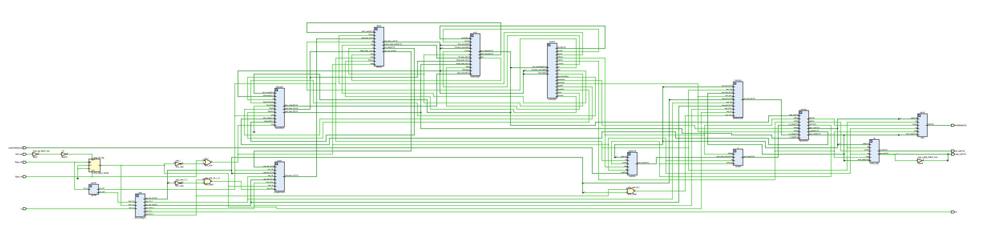

### 三、子模块

#### 1、Ifetc32 （Instruction Fetch）

	该模块用于从programrom（即指令内存）中取出指令，并根据指令在时钟的下降沿更新PC。

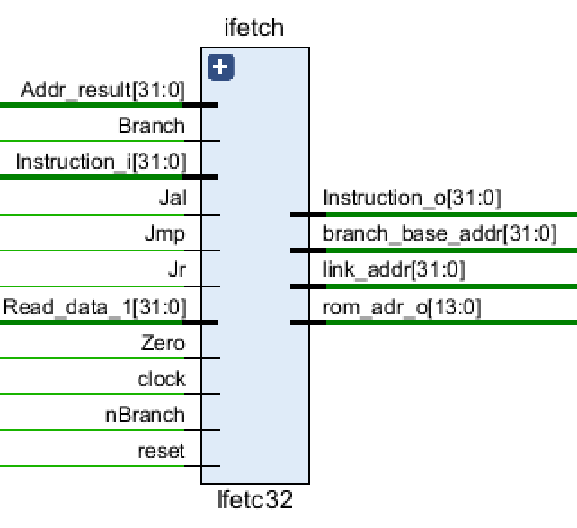

```verilog
// from top
input clock, reset;           // Clock and reset

// from programrom
input[31:0] Instruction_i;

// from ALU
input[31:0] Addr_result;      // the calculated address from ALU
input Zero;                   // while Zero is 1, it means the ALUresult is zero
    
// from Decoder
input[31:0] Read_data_1;      // the address of instruction used by jr instruction
    
// from Controller
input Branch;                 // while Branch is 1,it means current instruction is beq
input nBranch;                // while nBranch is 1,it means current instruction is bnq
input Jmp;                    // while Jmp 1, it means current instruction is jump
input Jal;                    // while Jal is 1, it means current instruction is jal
 input Jr;                    // while Jr is 1, it means current instruction is jr

output[31:0] Instruction_o;   // the instruction fetched from this module
output[31:0] branch_base_addr;// (pc+4) to ALU which is used by branch type instruction
output reg [31:0] link_addr;  // (pc+4) to Decoder which is used by jal instruction
output[13:0] rom_adr_o;       // pc[15:2]
```

#### 2、decode32 (Decoder)

	解析指令，并对立即数做符号扩展。
	
	addi (001000) (sign), addiu (001001) (sign), slti(001010) (sign) 做的都是有符号扩展，而 sltiu (001011) (zero), andi(001100)(zero), ori(001101)(zero), xori(001110)(zero) 做的都是无符号扩展。lui (001111) {imm, 16'b0} 这条指令将会在ALU中处理。

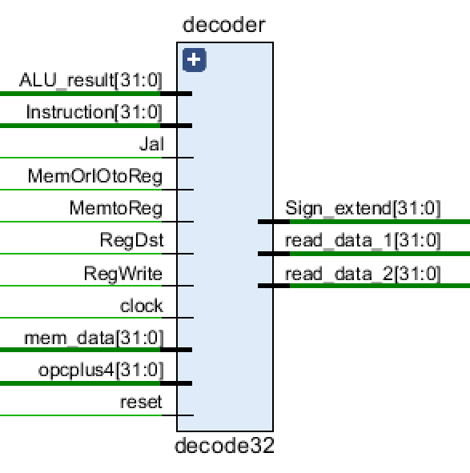

```verilog
input        clock, reset;    // 时钟和复位
input[31:0]  Instruction;     // 取指单元来的指令
input[31:0]  mem_data;        // 从DATA RAM or I/O port取出的数据
input[31:0]  ALU_result;      // 从执行单元来的运算的结果
input        Jal;             // 来自控制单元，说明是JAL指令 
input        RegWrite;        // 来自控制单元
input        MemtoReg;        // 来自控制单元
input        RegDst;             
input[31:0]  opcplus4;        // 来自取指单元，JAL中用
input        MemOrIOtoReg;

output[31:0] read_data_1;     // 输出的第一操作数
output[31:0] read_data_2;     // 输出的第二操作数
output[31:0] Sign_extend;     // 扩展后的32位立即数
```

#### 3、control32（Controller）

	由一系列的组合逻辑电路构成。执行指令解析后对应的操作，并发送相应的信号到其他模块。

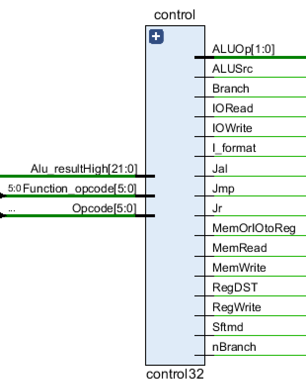

```verilog
input[5:0] Opcode;              // instruction[31..26], Opcodecode
input[5:0] Function_opcode;     // instructions[5..0], Function_opcode
// The real address of LW and SW is Alu_Result, the signal comes from the execution unit
// From the execution unit Alu_Result[31..10], used to help determine whether to process Mem or I
input[21:0] Alu_resultHigh; // From the execution unit Alu_Result[31..10]
    
output Jr;                 // 1 indicates the instruction is "jr", otherwise it's not "jr" 
output Jmp;                 // 1 indicate the instruction is "j", otherwise it's not
output Jal;                 // 1 indicate the instruction is "jal", otherwise it's not
output Branch;              // 1 indicate the instruction is "beq" , otherwise it's not
output nBranch;             // 1 indicate the instruction is "bne", otherwise it's not
output RegDST;              // 1 indicate destination register is "rd"(R),otherwise it's "rt"(I)
output MemtoReg;            // 1 indicate read data from memory and write it into register
output RegWrite;            // 1 indicate write register(R,I(lw)), otherwise it's not
output MemWrite;            // 1 indicate write data memory, otherwise it's not
output ALUSrc;              // 1 indicate the 2nd data is immidiate (except "beq","bne")
output Sftmd;               // 1 indicate the instruction is shift instruction
output I_format;            // 1 indicate the instruction is I-type but isn't "beq","bne","LW" or "SW" 
output[1:0] ALUOp;          // if the instruction is R-type or I_format, ALUOpcode is 2'b10;
                                // if the instruction is"beq" or "bne", ALUOpcode is 2'b01??
                                // if the instruction is"lw" or "sw", ALUOpcode is 2'b00??
    
output MemOrIOtoReg;        // 1 indicates that data needs to be read from memory or I/O to the register
output MemRead;             // 1 indicates that the instruction needs to read from the memory
output IORead;              // 1 indicates I/O read
output IOWrite;             // 1 indicates I/O write
```

#### 4、executs32 （ALU）

	执行一系列的算术逻辑操作，包括地址的计算结果。

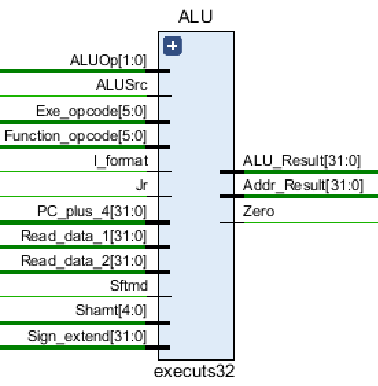

```verilog
// from Decoder
input[31:0] Read_data_1;        // the source of Ainput
input[31:0] Read_data_2;        // one of the sources of Binput
input[31:0] Sign_extend;        // one of the sources of Binput

// from IFetch
input[5:0] Exe_opcode;          // instruction[31:26]
input[5:0] Function_opcode;     // instructions[5:0]
input[4:0] Shamt;               // instruction[10:6], the amount of shift bits
input[31:0] PC_plus_4;          // pc+4

// from Controller
input[1:0] ALUOp;               // { (R_format || I_format) , (Branch || nBranch) }
input ALUSrc;                   // 1 means the 2nd operand is an immedite (except beq, bne）
input I_format;                 // 1 means I-Type instruction except beq, bne, LW, SW
input Sftmd;                    // 1 means this is a shift instruction
input Jr;                       // 1 means this is a jr
    
output Zero;                    // 1 means the ALU_reslut is zero, 0 otherwise  
output reg[31:0] ALU_Result;    // the ALU calculation result
output[31:0] Addr_Result;       // the calculated instruction address
```

#### 5、dmemory32（Data Memory）

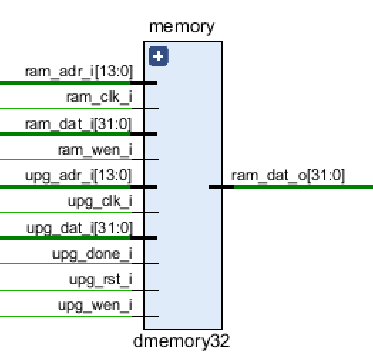

```verilog
input ram_clk_i;                      // from CPU top
input ram_wen_i;                      // from Controller
input [13:0] ram_adr_i;               // from alu_result of ALU
input [31:0] ram_dat_i;               // from read_data_2 of Decoder

// UART Programmer Pinouts
input upg_rst_i;                      // UPG reset (Active High)
input upg_clk_i;                      // UPG ram_clk_i (10MHz)
input upg_wen_i;                      // UPG write enable
input [13:0] upg_adr_i;               // UPG write address
input [31:0] upg_dat_i;               // UPG write data
input upg_done_i;                     // 1 if programming is finished

output [31:0] ram_dat_o;              // the data read from data-ram
```

#### 6、MemOrIO（Memory or IO）

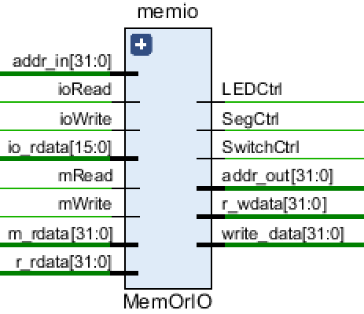

```verilog
input mRead;                // read memory, from Controller
input mWrite;               // write memory, from Controller
input ioRead;               // read IO, from Controller
input ioWrite;              // write IO, from Controller
    
input[31:0] addr_in;        // from alu_result in ALU
    
input[31:0] m_rdata;        // data read from Data-Memory
input[15:0] io_rdata;       // data read from IO,16 bits

input[31:0] r_rdata;        // data read from Decoder(register file)

output[31:0] addr_out;      // address to Data-Memory
output[31:0] r_wdata;       // data to Decoder (register file)
output reg[31:0] write_data;// data to memory or I/O（m_wdata, io_wdata）
    
output LEDCtrl;             // LED Chip Select
output SwitchCtrl;          // Switch Chip Select
output SegCtrl;             // Segment Display Select
```

#### 7、programrom（Program ROM）

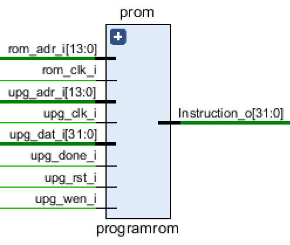

```verilog
// Program ROM Pinouts
input rom_clk_i,                // ROM clock
input[13:0] rom_adr_i,          // From IFetch

output [31:0] Instruction_o,    // To IFetch
    
// UART Programmer Pinouts
input upg_rst_i,                // UPG reset (Active High)
input upg_clk_i,                // UPG clock (10MHz)
input upg_wen_i,                // UPG write enable
input[13:0] upg_adr_i,          // UPG write address
input[31:0] upg_dat_i,          // UPG write data
input upg_done_i                // 1 if program finished
```

#### 8、ioread（IO read）

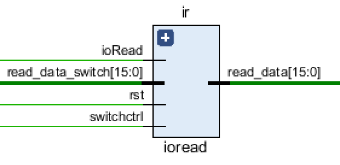

```verilog
input rst;			
input ioRead;                  // ioRead from controller
input switchctrl;		       // switchctrl from MemOrIO
input[15:0] read_data_switch;  // data read from switch

output[15:0] read_data;	       // to MemOrIO
```

#### 9、led16（LED）

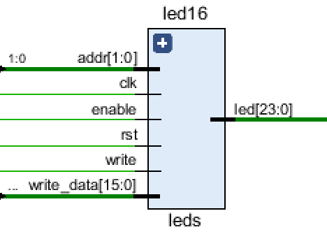

```verilog
input clk;    		    
input rst; 		        
input write;		        // ioWrite from controller
input enable;		        // ledctrl from MemOrIO
input[1:0] addr;	        // last 2 bit of address
input[15:0] write_data;	    // data written to the led

output reg[23:0] led;	    // 24 bit signal sent to board
```

#### 10、switch16（Switch）

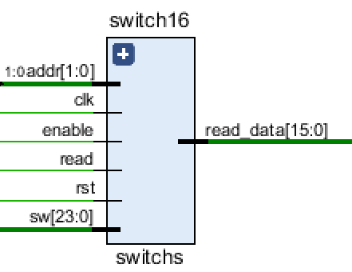

```verilog
input clk;			       
input rst;			       
input enable;			    // SwitchCtrl from MemOrIO
input[1:0] addr;		    // last 2 bit of address
input read;			        // ioRead from controller

output reg [15:0] read_data;// data read from switch, sent to ioRead
input [23:0] sw;		    // from the 24 switches on board
```

#### 11、scan_seg（Scan Seg）

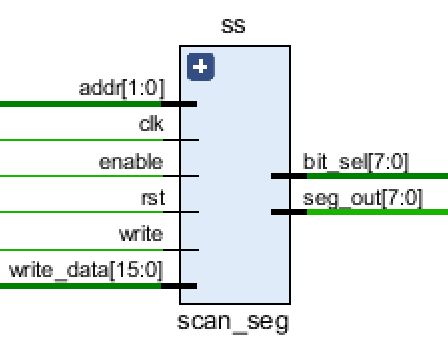

```verilog
input clk,
input rst,
input write,
input enable,
input[1:0] addr,	      // last 2 bit of address
input[15:0] write_data,	  //  data written to the led

output [7:0] bit_sel,
output [7:0] seg_out
```
